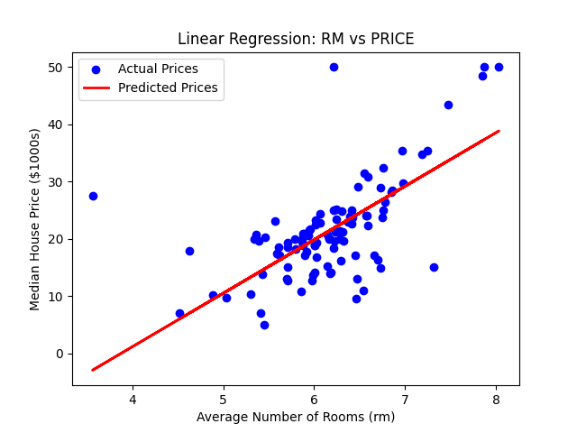

# Boston House Price Prediction using Linear Regression

## Project Goal
The objective of this project is to build a simple linear regression model to predict the median value of homes in Boston based on the average number of rooms per dwelling.

## Technologies Used
- Python
- Pandas
- Scikit-learn
- Matplotlib

## How to Run
1.  **Clone the repository:**
    ```bash
    git clone https://github.com/Srikar131/Boston-House-Price-Prediction.git
    cd Boston-House-Price-Prediction
    ```
2.  **Create and activate a virtual environment and install dependencies:**
    ```bash
    python -m venv .venv
    source .venv/Scripts/activate
    pip install -r requirements.txt
    ```
3.  **Run the script:**
    ```bash
    python price_predictor.py
    ```

## Results
The model yielded an R² Score of approximately 0.37. The plot below visualizes the model's predictions (red line) against the actual data points (blue dots).


